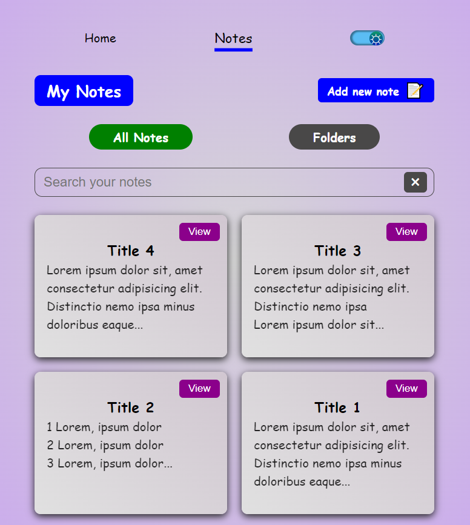

# Notes-app

---
 

> ### CRUD Features
 

> ### Saving notes in Folder UI
 

> ### Reusable Components
 

> ### React Hooks, Custom Hooks
 

> ### Context API - State management globally
 

> ### sassStyles
 

 

